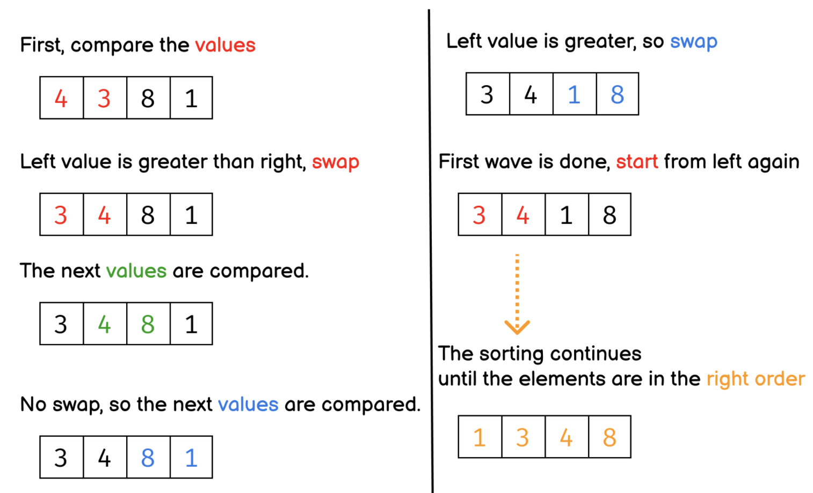
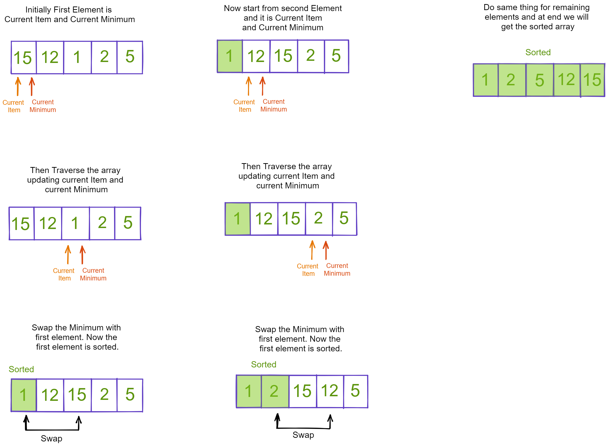
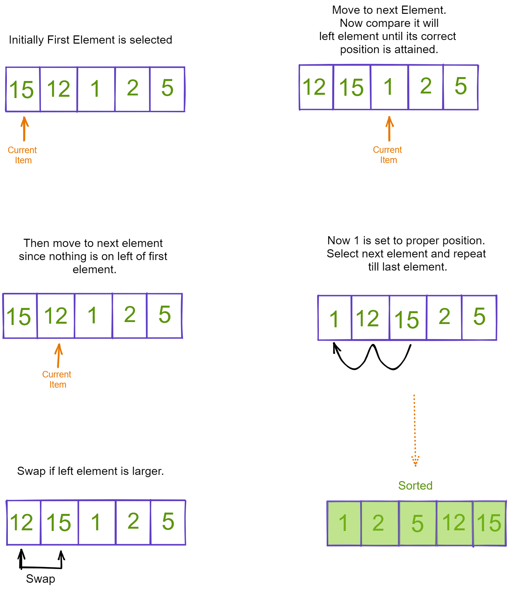

## Implement Sorting Algorithms

We learned about different sorting algorithms in the previous block. Implement the sorting algorithms you learned in the videos as a function.

1. Write down the steps to perform for different sorting algorithms i.e bubble, insertion and selection. Write in your own words. After writing the algorithm take an example of an array and draw the diagram for each step for different algorithm.

Example:

#### Bubble Sort

step-1: We will compare the first item with the second. If the first item is bigger than the second item we will swap them so that the bigger one stays in the second position.

step-2: And then compare second with third item. If second item is bigger than the third, we swap them. otherwise, they stayed in their position. Hence, the biggest among first three is in the third position.

step-3: We keep doing it. Until we hit the last element of the array. In that way we bubble up the biggest item of the array to the right most position of the array.

step-4: Now we will repeat the step 1, 2 and 3 but we will keep in mind not to touch the last element.



<!-- You answer -->

#### Selection Sort

step-1: First we will set current item and smallest item to first item of the array then traverse the array to find the smallest number. Then swap the new minimum with the first item of the array. Now first element is sorted.

step-2: Now again we will repeat the same process starting from second index of the array. find new minimum and swap with second index.

step-3: We keep doing it. Until we sort the array.



#### Insertion Sort

step-1: First we will select the first element and check any element left of it. Since it is first element, there wont be any other element. So consider it sorted.

step-2: Now move to second element, check its left element and compare, if it is less than left element then swap.

step-3: Now move to next element, and check if its position is correct or not by checking against left element, until we found its correct position.

step-4: Continue doing this until last element and we will get the sorted array.



2. Create a function named `bubbleSort` that accepts an array of numbers and returns the array with sorted values. The elements should be in ascending order. Use the bubble sorting algorithms. After writing the function test it with an array and check if you are getting the right output.

```js
function bubbleSort(arr) {
  let j = arr.length;
  while (j > 0) {
    for (let i = 0; i < j; i++) {
      if (arr[i] > arr[j]) {
        [arr[i], arr[j]] = [arr[j], arr[i]];
      }
    }
    j--;
  }
  return arr;
}
```

3. Create a function named `selectionSort` that accepts an array of numbers and returns the array with sorted values. The elements should be in ascending order. Use the selection sorting algorithms. After writing the function test it with an array and check if you are getting the right output.

```js
function selectionSort(arr) {
  let j = 0;
  while (j < arr.length) {
    let minIndex = j;
    for (let i = j + 1; i < arr.length; i++) {
      if (arr[i] < arr[minIndex]) {
        minIndex = i;
      }
    }
    if (j !== minIndex) {
      [arr[j], arr[minIndex]] = [arr[minIndex], arr[j]];
    }
    j++;
  }
  return arr;
}
```

4. Create a function named `insertionSort` that accepts an array of numbers and returns the array with sorted values. The elements should be in ascending order. Use the insertion sorting algorithms. After writing the function test it with an array and check if you are getting the right output.

```js
function insertionSort(arr) {
  for (let i = 1; i < arr.length; i++) {
    let j = i - 1;
    while (arr[i] < arr[j]) {
      [arr[i], arr[j]] = [arr[j], arr[i]];
      i--, j--;
    }
  }

  return arr;
}
```

5. After writing all the sorting algorithm check the output with the array given below and make sure you are getting the right output.

```js
let values = [76, 34, 12, 32, 4, 2, 123, 5667, 8, 1, 3];
```
