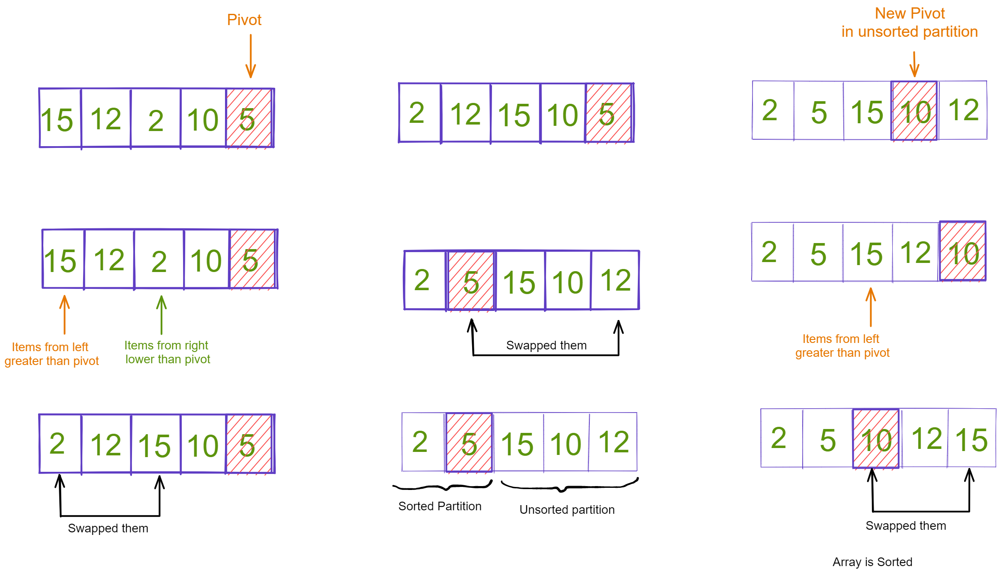

## Implement Sorting Algorithms

1. Write down the steps to perform for different sorting algorithms i.e merge and quick sort. Write the steps in your own words. After writing the algorithm take an example of an array and draw the diagram for each step for different algorithm.

Example:

#### Bubble Sort

step-1: We will compare the first item with the second. If the first item is bigger than the second item we will swap them so that the bigger one stays in the second position.

step-2: And then compare second with third item. If second item is bigger than the third, we swap them. otherwise, they stayed in their position. Hence, the biggest among first three is in the third position.

step-3: We keep doing it. Until we hit the last element of the array. In that way we bubble up the biggest item of the array to the right most position of the array.

step-4: Now we will repeat the step 1, 2 and 3 but we will keep in mind not to touch the last element.

step-5: After repeating all the above steps you will get a sorted array


<!-- You answer -->

#### Merge Sort

step-1: First, we will divide the given array in half and continue divide the new arrays in half until we get each indivdual element.

step-2: Now, we will compare the two consectutive elements and then arrange them and create new array, initially we will make multiple sorted arrays of two elements each.

step-3: We will continue sorting the array next by combining them and creating new arrays. Atlast we will get the final sorted array.


2. Create a function named `mergeSort` that accepts an array of numbers and returns the array with sorted values. The elements should be in ascending order. Use the bubble sorting algorithms. After writing the function test it with an array and check if you are getting the right output.

```js
function mergeSort(arr) {
  if (arr.length <= 1) {
    return arr;
  }
  let arr1 = arr.slice(0, Math.floor((arr.length + 1) / 2));
  let arr2 = arr.slice(Math.floor((arr.length + 1) / 2), arr.length);

  arr1 = mergeSort(arr1);
  arr2 = mergeSort(arr2);

  return merge(arr1, arr2);
}

function merge(arr1, arr2) {
  let newArr = [];
  while (arr1.length && arr2.length) {
    if (arr1[0] > arr2[0]) {
      newArr.push(arr2[0]);
      arr2.splice(0, 1);
    } else {
      newArr.push(arr1[0]);
      arr1.splice(0, 1);
    }
  }
  while (arr1.length) {
    newArr.push(arr1[0]);
    arr1.splice(0, 1);
  }
  while (arr2.length) {
    newArr.push(arr2[0]);
    arr2.splice(0, 1);
  }
  return newArr;
}
```

#### Quick Sort

step-1: For quick sort we initially have to decide a pivot, generally to decide a pivot we take a median value of three elements i.e, the first element, the last element and the middle element. A pivot is the element from the array that once sorted should have correct position and items to its left are smaller and items to its right are larger.

step-2: Once pivot is decided we move to the end of the array and now we look from two things, elements which are larger than pivot starting from left and elements which are smaller than pivot that are smaller than pivot, then we swap them.

step-3: We repeat this process until elements from left has greater index than elements from right. Then we swap element from left with the pivot. Now the pivot value is sorted.

step-4: We then continue this process for remaining subarrays recursively to get the sorted array.



3. Create a function named `quickSort` that accepts an array of numbers and returns the array with sorted values. The elements should be in ascending order. Use the selection sorting algorithms. After writing the function test it with an array and check if you are getting the right output.

```js
function quickSort(arr, low, high) {
  let index;
  if (arr.length > 1) {
    index = partition(arr, low, high);
    if (low < index - 1) {
      quickSort(arr, low, high - 1);
    }
    if (index < high) {
      quickSort(arr, index, high);
    }
  }
  return arr;
}

function partition(arr, low, high) {
  let pivot = arr[Math.floor((low + high) / 2)];

  let i = low,
    j = high;

  while (i <= j) {
    while (arr[i] < pivot) {
      i++;
    }
    while (arr[j] > pivot) {
      j--;
    }
    if (i <= j) {
      [arr[i], arr[j]] = [arr[j], arr[i]];
      i++;
      j--;
    }
  }
  return i;
}
```

4. After writing all the sorting algorithm check the output with the array given below and make sure you are getting the right output.

```js
let values = [76, 34, 12, 32, 4, 2, 123, 5667, 8, 1, 3];
```
